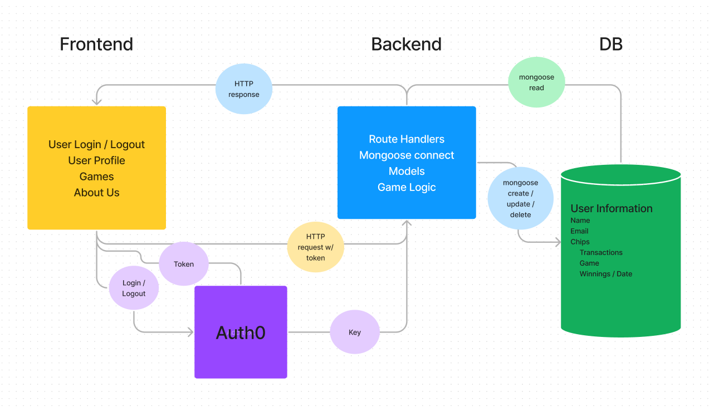
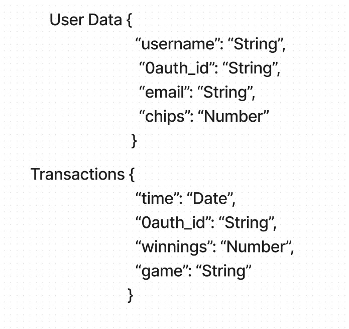
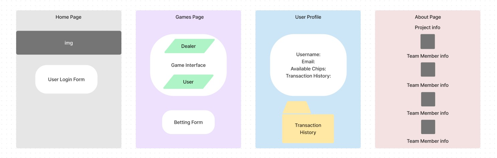

# CodeFellows-Casino-Backend

**Team Members:**

Joshua Frazer   
Anthony Johnson   
Mandy Mason   
Mandela Steele-Dadzie   

## Vision

The vision of this app is to provide users with an entertainment platform that allows them to login to their own account and play games of chance. This app is intended for free entertainment purposes. We love games! Who doesn’t love games?

## In-Scope 

Users will log in username and email 
Our game app will allow users to bet with virtual ‘chips’ while playing Blackjack.
This product will have all of the features of a standard Blackjack game.
Users’ games will be tracked 

## Out-Scope

Users will only play against the ‘dealer’ (server logic), not other humans

## MVP

- User Login
- Fully functioning Blackjack game
- User ability to bet on the game
- Save user data to database

## Data Flow

User logs in, request is sent to auth0 for authentication, user access and plays game, front-end communicates with back-end for game logic and betting outcomes, game and user information is stored in the database.

## Non-Functional Requirements

User login / logout will be possible via auth0, and user data will be stored in the database by utilizing the auth0 id property. We will use React for clarity and usability, and visual appeal. We will follow the single-responsibility principle for ease of testability.

## Domain Model Diagram (Figma)

## [User Stories](https://trello.com/timezonebandits) (Trello)

## Database Schema Diagram (Figma)

## Wireframe (Figma)

